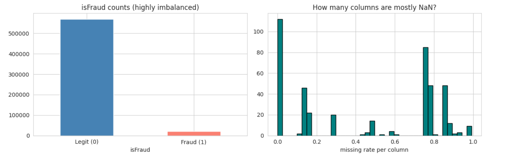
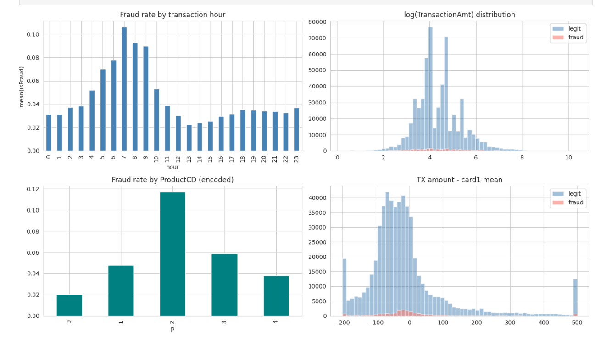
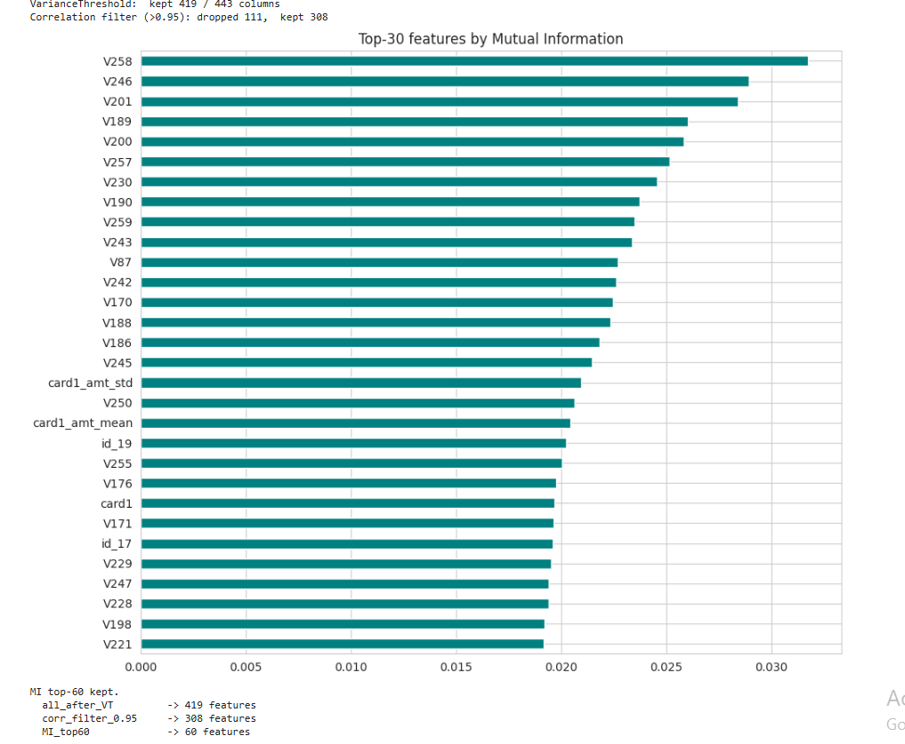
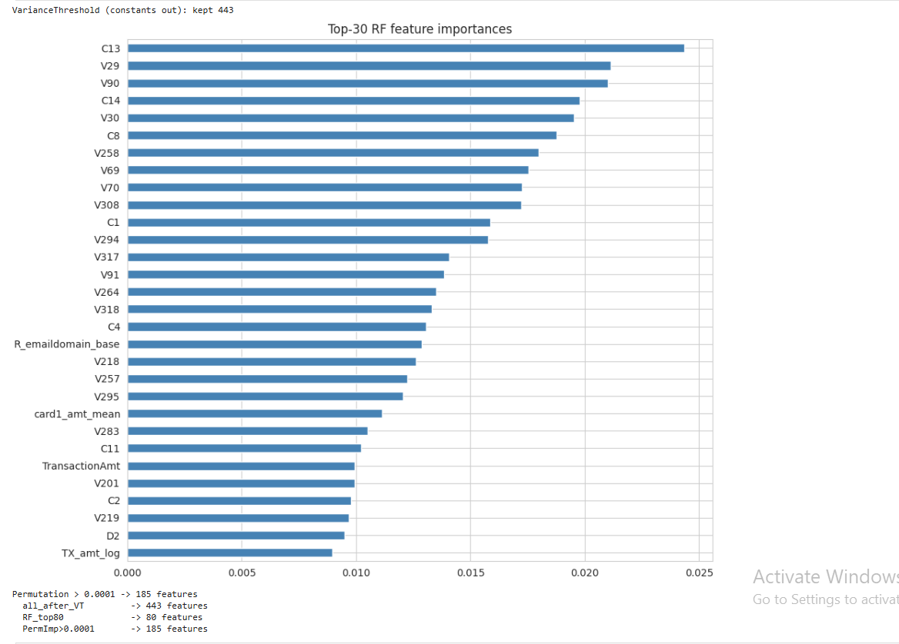
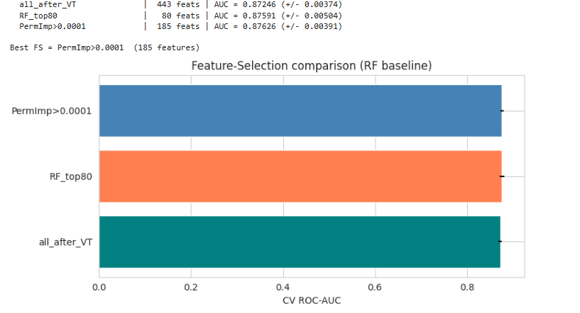
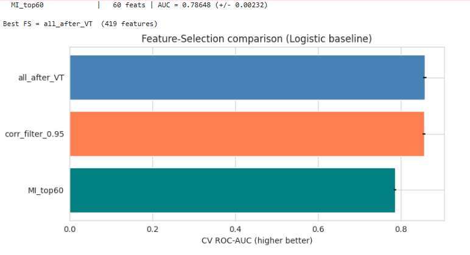

# IEEE-CIS Fraud Detection


ჩვენი მიზანი, რომ დავადგინოთ თაღლითური/ყალბი ტრანაქციები. ანუ უნდა დავაპრედიქტოთ 1/0 მოცემული მონაცემების მიხედვით. მეტრიკად გამოყენებული არის ROC-AUC დაპრედიქტებული ალბათობისა და ტარგეტს შორის.


## repo სტრუქტურა

```
ML-HW2/      
├── imgforrm/                         # screenshots / graphs for readme
├── model_experiment_LinearRegression.ipynb   მოდელისთვის cleaning, feature engineering, selection, training. იგივე დანარჩენებისთვისაც
├── model_experiment_LogisticRegression.ipynb
├── model_experiment_DecisionTree.ipynb
├── model_experiment_RandomForest.ipynb
├── model_experiment_AdaBoost.ipynb
├── model_experiment_XGBoost.ipynb
├── model_experiment_LightGBM.ipynb
├── model_inference.ipynb             # საუკეთესო მოდელის წამოღება mlflowს model registry დან და submission.csv დაგენერირება
├── .gitignore
└── README.md     #დოკუმენტაცია
```


## Data 




  პირველ რიგში დატაში აღსაღნიშნავია, რომ მოსაძებნი მონაცემის პროცენტულობა მხოლოდ 3.5%ია, ხოლო დანარჩენის 96.5%. ნებისმიერმა მოდელმა რომ ბრმად დააპრედიქტოს 96.5% ექურასის მიიღებს, თუმცა auc 0.5 იქნება. ამიტომაც უნდა მივაქციოთ უფრო მეტი ყურადღება auc, recall, precision-recall.

identity table მხოლოდ უზრუნველყოფს სტრიქონების 25%ს, ამიტომაც left joinს ვაკეტებთ transactionIDსთან იმისთვის, რომ იგი nullებით მაინც იყოს სავსე და ტრანზაქციები არ დავკარგოთ.


## Feature Engineering

კატეგორიულების რიცხებში გადაყვანა


  one hot encoding: კარგად მუშაობდა ისეთ სვეტებზე, სადაც ცოტა განსხვავებული, unique ველიუ არის (card4, card6, ProductCD, M1..M9). ბევრით კი წრფივი მოდელების დატრენინგება რთული ხდება. 
  Label Ecoding ყველა ობჯექტი სვეტში იღებს (ველიუ, ინდეხს) მაპს, რომლეიც მხოლოდ ტრეინზე იფიტება. სხვა დროს უნახავი ველიუები იღებენ -1 ველიუს (სენტინელს).


რატომ არის Label Encoding OHEზე უკეთესი:


  ხის მოდელები (XGBoost, Random Forest, LightGBM) უკეთ ჰენდლავენ label encodingს. რადგან ამ მოდელებში უფრო დამოკიედბულია სპლიტის თრეშჰოლდზე და არა თვითონ რიცხვით ველიუებზე.
  ასეთ ამოცანებში, სადაც ყალბი ტრანზაქციების ამოცნობას გვთხოვენ, კატეგორიის სიხშირე უფრო ინფორმატიულია ვიდრე თვით კატეგორია. ამას კი OHE ვერ ამოიცნობს.

  


Nullების გადარჩევა

 ამ ამოცანაში ველიუს გარეშე მყოფი future არ არის უბრალოდ დაკარგული ინფორმაცია. პირიქით, ამ ინფორმაციის არ ქონა სიგნალია იმისა, რომ შეიძლება თაღლითური ტრანზაქცია იყოს. მაგალითად card2 IS NULL კორელირებულია მაღალ სითაღლითის რეითთან. ამიტომ ჩვენი ქლინინგი მინიმუმს აკეთებს:


   რიცხვით სვეტეს დავუტოვე ნალები - პაპილაინში მაინც მედიანას იღებს ამიტომ ლოგიკა იგივვე რჩება
   ენკოდირებული ველიუები(label encoding) იღებენ -1ს. ენკოდერი ფიტისას არ აძლევს არაფერს -1 ველიუს, ამიტომ მოდელს შეუძლია ერთი სპლიტით დააშოროს უნახავი ან უცნობი ველიუები ტრეინისას.
   +- უსასრულობას ვცვლით ნალით.


გასუფთავება

```text

   კონსტანტების სვეტებს არ აქვთ გეინი, მათი დატოვება არ გვაწყობს. იგი შეანელებდა ტრეინინგის პროცესს და მოდელებს ოვერფიტისკენ წაიყვანდა.
   სვეტებს, რომლებსაც 95%ზე მეტი ნალები აქვთ, ძალიან ცოტა ინფორმაციას აძლევენ მოდელს, იმისთვის რომ რამე ისწავლოს. ის უბრალოდ ნოიზია, განსაკუთრებით ხის მოდელებისთვის, სადაც ერთმა არანალმა სტრიქონმა შეიძლება სპლიტი გადაწყვიტოს.
   სვეტები სახელად V300 და 300ზე მეტი, იყვნენ 95%ზე მეტი ნალ ველიუებით ისინიც დავდროპეთ, რათა ოვერფიტის რისკი დაგვეწია.
```

Feature Engineering


```text

  ჩვენი სამიზნე ცვლადის რეიტი ღამის საათებში 2-3ჯერ მეტი იყო ვიდრე პიკის საათებში, ამიტომ შემოვიღეთ ახალი ცვლადი TX_hour რომელიც მოდელებს დაეხმარებოდა მათ მარტივად აღმოჩენაში.
  ტრანზაქციი სრაოდენობის ლოგარითმი საკმაოდ განსხვავდებოდა ნამდვილი და ყალბი ტრანზაქციებისთვის,
  ყალბ ტრანზაქციებს უფრო მეტი დაბალი ოდენობის ტრანზაქცია ჰქონადთ. ეს ცვლადი წრფივ მოდელებს საკმკაოდ დაემხარება.
  card1_amt_diff არის რამდენად არის გადახრა ნორმალური ამ ქარდის ტრანზაქციებიდან. ეს საკმაოდ ძლიერი პრედიქტორია ყალბი ტრანზაქციებისთვის

```

   TX hour, day, dow, transactionDT არის საათი/დღე/კვირისდღე მარტივად გამოყოფენ დროის იმ შუალედებს, როცა ბევრად მეტი ყალბი ტრაზაქცია ხდება
   TX_amt_log ტრაზაქციების რაოდენობად გადახრა აქვს, ეხმარება წრფივ მოდელებს
   TX_amt_decimal ცენტების რაოდენობა, ყალბი ტრანზაქციები ხშირად არის .99 ით დაბოლოებული
   ასევე განვსაზღვრავთ ემეილის დომეინს, რადგან მათ განსხვავებული რისკი აქვთ.
   ამისთვის გვაქვს ცალკე ცვლადი emaildomain_risk რომელიც 1ით ნიშნავს დომეინებს რომლებსაც უფრო დიდი რისკი აქვთ.
   card1_amt_mean / std / diff თითოეული ქარდი დაფიტული ტრეინზე, განსხვავება ქარდის ნორმალური ტრანზაქციებისგან

  TX_hour გამოდის top 10 feature როდესაც მათ მნიშვნელოვნებით დავალაგებთ ყველა ხის მოდელისთვის
  card1_amt_diff არის xgboostის Lightgbmის ტოპ 3 
  freq feature ამატებს დაახლოებით 0.005-0.010 AUCს წრფივი მოდელებისთვის და 0.002 AUC ხის მოდელებისთვის


## Feature Selection

 სხვადასხვა მოდელებისთვის გამოვიყენე სხვადახსვა feature selection მეთოდი, თავიდან უფრო ავიღე იმის ანალიზით, თუ რომელი მეთოდი როგორი ტიპის მოდელებს გამოადგებოდა.

 წრფივი მოდელებისთვის (linear reg, logistic reg) გამოვიყენე variance threshold, correlation filter, mutual infomation

 ხის მოდელებისთვის (decision tree, randomforest, adaboost, xgboost, lightgbm) გამოვიყენე variance threshold, random forestის იმპორტენსი, permutation importance

  წრფივი მოდელებისთვის ავირჩიე აღნიშნული მეთოდები რადგან ისინი უფრო სენსეტიურები არიან:
  მაღალ კოლერლებულ featurebზე, არასტაბილურ კოეფიციენტებზე
  featurebზე რომლებსაც ძალიან დაბალი ვარიაცია აქვთ
  დიდი რაოდენობით noisy featurebზე (რომლის გაფიქსვაც რეგულარიზაციას შეეძლო, მაგრამ არა სრულად)

  ვამოწმებთ ამ სელექშენის მეთოდებს და მათ ვადარებთ სწრაფი ქროს ვალიდაციით.


```text

  
  VarianceThreshold აშორებს ისეთ სვეტებს, სადაც ველიუ თითმიქს ერთი და იგივეა. გამოდის 5-10 სვეტი რომელთა ვარიაციაც ძალიან დაბალია და მოდელს დიდ ინფორმაციას არ აძლევს

  colleration filter - ზოგ სვეტში ძალიან ბევრი დუპლიკატი ველიუი იყო, იგი მათ აშორებს, რადგან წრფივი მოდელები იდენტურ სვეტებზე ცუდ კოეფიციენტებს აირჩევდნენ.
  
  
  Mutual information -  სქორავს არა წრფივ დამოკიდებულებას ტარგეტთან, პრაქტიკაში იგი უკეთესია რადგან შენარჩუნებული feature უფრო ინფორმატიულია, არაა ნოისი.


  საუკეთესო მეთოდი დამოკიდებულია დატას კოლერილებულ სტრუქტურაზე. mutual information საუკეთესო აღმოჩნდა რადგან იგი რეგულარიზაციაზე უკეთ ფილტრავს ნოიზი სვეტებს.

```

   

 ხის მოდელებისთვის:


  მაღალი კოლერაცია არაა პრობლემა, ხე ირჩევს კოლერილებული featureბიდან 1ს და დანარჩენებს აიგნორებს, ამიტომ არ არის კოლერაციის ფილტრი აუცილებელი.
  მაინც კარგი არის, ისეთი სვეტების დადროპვა, სადაც თითქმის ერთი და იგივე ველიუა, რადგან ის უბრალოდ ნოისს მატებს.
  ყველაზე ეფექტური მეთოდი ხის მოდელებისთვის არის model based importance, random forestის ფიტი გვაძლევს საკმაოდ სასარგებო რანკინგს featureბის შეფასებისთვის
We test three strategies:

1. Variance Threshold
2. RF embedded importance (top-K)
3. Permutation importance

```text
  ვარიაციის თრეშჰოლდი ხშირად კარგად მუშაობს, რადგან ხე თვითონ ირჩევს გასპლითვის featureს.

  random forestის გამოყენებით დარანკვა კარგად აბალანსებს featureბს და მათ აკურატულობას.

  permutation importance არის უფრო მკაცრი ფილტრაციის მეთოდი - ის აშორებს featureბს რომლებიც არ ცვლიან AUCს. ამიტომ იგი ძალიან ამცირებს ფიჩერების რაოდენობას, რამაც შეიძლება კარგი ინფორმაციის გეინის მქონე სვეტებიც დაგვაკარგვინოს. 

``` 

   


   ყველა ნოუთბუკში feature selectionის შემდეგ დატოვებული სვეტები ფასდება 3 fold rocauc ქროს ვალიდაციით. logisticregression გამოიყენება წრფივი მოდელებისთვის განსაზღვრული მეთოდებისთვი, ხოლო random forest ხეებისთვის.








## Training

გამოყენებული არქიტექტუერბი და მათი ჰიპერპარამეტრები:

Linear, `LinearRegression` (regression-on-binary baseline), OLS, Ridge α∈{1, 10, 100}, Lasso α∈{1e-4, 1e-3}
Linear, `LogisticRegression`, C∈{0.01, 0.1, 1, 10}, balanced vs unbalanced, L1 vs L2
Trees, `DecisionTree`, `max_depth`∈{3, 5, 10, 15, None}, `min_samples_leaf`, `min_samples_split`, `criterion`
Trees, `RandomForest`, `n_estimators`∈{100, 200, 300, 500}, `max_depth`, `max_features`∈{`sqrt`, 0.3, 0.5}
Boosting, `AdaBoost`, `n_estimators`, `learning_rate`, base estimator depth
Boosting, `XGBoost`, `lr`, `n_est`, `depth`, `scale_pos_weight`, `subsample`, `colsample`, `reg_α/λ`
Boosting, `LightGBM`, `lr`, `n_est`, `num_leaves`, `min_child_samples`, `subsample`, `colsample`, `reg_α/λ`, `class_weight`

UNDERFIT — train_auc < 0.75
OVERFIT — overfit_gap > 0.05
mild-overfit — overfit_gap ∈ (0.02, 0.05]
HEALTHY — val_auc ≥ 0.85 and overfit_gap ≤ 0.02

თთოექული მოდელის ანალიზი

LinearRegression

```text

  მოდელი არ არის კლასიფიკაციისთვის, პრედიქცია არ არის ალბათობა და MSE ევალუაციის არასწორი მეტრიკაა. მაგრამ ROG_AUCსთვის, უბრალო აუთფუთი მაინც შეიძლება სქორად გამოვიყენოთ.

  ამ მოდელს ვიყენებთ ბეისლაინად/სპეციალურად აღებულ ცუდ მოდელად. დემოსტრაციას ვაკეთებთ იმისა თუ ვნახოთ როგორ ცუდ შედეგს დადებს იგი, რათა შემდეგ სხვა მოდელებს შევადაროთ. ამიტომაც ვამატებთ რეგულარიზაციებს (L1, L2) რათა ვნახოთ როგორ ცვლის აუთფუთს


```

შედეგები:

```text
              name      train_auc  val_auc   val_ap   overfit_gap  diagnosis
       Ridge a=1.0      0.847330   0.842783  0.422918    0.004547        ok
       Ridge a=100      0.847165   0.842516  0.422336    0.004650        ok
      Ridge a=10.0      0.847155   0.842495  0.422990    0.004660        ok
      Lasso a=1e-4      0.846404   0.841986  0.418376    0.004418        ok
      Lasso a=1e-3      0.832800   0.833115  0.393899   -0.000315        ok
              OLS       0.834546   0.832980  0.396983    0.001566        ok

- 6 runs  | HEALTHY: 0 | OVERFIT: 0 | UNDERFIT: 0
- Best   : Ridge a=1.0  ->  val AUC = 0.84278,  gap = +0.0045
- Worst  : OLS          ->  val AUC = 0.83298,  gap = +0.0016
```

  ჩვეულებრივი წრფივი რეგრესია იღებს წონებს, რათა mseს მინიმიზაცია შეძლოს, რაც არაფერ შუაშია კლასიფიკაციის ალბათობასთან ან ლოგ ლოსთან. ridge alpha 10მდე სტაბილიზაციას უკეთებს კოეფიციენტებს aucის ძალიან შეცვლის გარეშე. ხოლო როცა იგი 100ის ტოლია კოეფიციენტები 0ს უახლოვდება. ქმნის ანდერფიტ მოდელს (high bias)
  lasso ბევრ კოეფიციენტს ანულებს, auc ეცემა ოდნავ, ხოლო მოდელი ხდება უფრო სწრაფი და პატაარ.
  ეს მოდელი სპეციალურად აღებულია, რათა ვნახოთ როგორ პერფონმასს დადებდა ცუდი მოდელი, რომელიც არც არის ასეთი პრობლემისთვის განსაზღვრული.


LogisticRegression

```text
  კლასიფიკაციისთვის ბეისლაინ მოდელი არის.
```

შედეგები:

```text
                     name  train_auc  val_auc   val_f1   val_ap   overfit_gap  diagnosis
LogReg_C=0.1,   l2 medium  0.869720   0.866756  0.231365 0.431380   0.002964    HEALTHY
  LogReg_C=10,    weak l2  0.869128   0.866583  0.231058 0.431533   0.002545    HEALTHY
LogReg_C=0.01,  l2 strong  0.868473   0.866077  0.230054 0.431186   0.002396    HEALTHY
  LogReg_C=1.0,   default  0.868209   0.865693  0.228774 0.429494   0.002516    HEALTHY
LogReg_C=1.0,   no weight  0.862015   0.859221  0.389237 0.452808   0.002794    HEALTHY
 LogReg_C=1.0,   l1 lasso  0.858122   0.857495  0.220723 0.406274   0.000627    HEALTHY


- 6 runs  | HEALTHY: 6 | OVERFIT: 0 | UNDERFIT: 0
- Best   : LogReg_C=0.1, l2 medium  ->  val AUC = 0.86676,  gap = +0.0030
- Worst  : LogReg_C=1.0, l1 lasso   ->  val AUC = 0.85750,  gap = +0.0006
```

C = 0.01 რეგულარიზაცია იმდენად ძლიერია, რომ მოდელს ანდერფიტის გარდა სხვა გზა არააქვს, იგი ვერაფერს ვერ სწავლობს. ტრეინის auc იგივეა რაც ვალიდაციის auc თუმცა ორივე დაბალია, მას მაღალი ბაიასი აქვს.
C = 0.1/1.0 კარგი გაპი აქვს და ბალანსირებულია.
C = 10 რეგულარიზაცია სუსტია, პატარა გაპი არის ტრეინსა და ვალიდაციას შორის.
L1 ბევრ კოეფიციენტს ანულებს, ოდნავ აგდებს aucს 
class_weight = balanced გარეშე მოდელი ძალიან იშვიათად აპრედიქტებს ყალბ ტრანზაქციებს, რექოლი ეცემა 


DecisionTree

```text


  ერთი დისიჟენ თრი სპლიტავს გინის ან ენთროპიის გეინის მიხედვით. როგორც მოდელს, მას დაბალი ბაიასი აქვს მაგრამ მაღალი ვარიაცია. პრედიქშენები მცირე ცვლილებებით ტრეინინგ დატაზე ძალიან იცვლება. max_depthის სხვადასხვა მნიშვნელობების აღება და მათი შემოწმება გვაძლევს სხვადასხვა შედეგს, underfit-კარგი-overfit.

  max_depth = 3 underfit ხეს არ შეუძლია კომპლექსური პრობლემის შესწავლა, რადგან ძალიან პატარაა
  max_depth = 10 min_samples_leaf >>1 კარგია, სწავლობს დამოკიდებულებასაც, და არ მიდის ოვერფიტში
  max depth = none ძალიან ოვერფიტედ მოდელი, იმახსოვრებს ყველაფერს ტრეინზე auc დაახლოებით 1 ია, ხოლო ახალ დატაზე ძალიან ცუდ შედეგს დებს
```

```text
                      name  train_auc  val_auc   val_f1   val_ap  overfit_gap    diagnosis
      DT_entropy criterion   0.897773 0.872468 0.232864 0.465048     0.025305 mild-overfit
 DT_depth=10 + min_leaf=20   0.894445 0.866499 0.275255 0.422287     0.027947 mild-overfit
DT_depth=10 + min_split=50   0.894799 0.865879 0.276797 0.414921     0.028920 mild-overfit
               DT_depth=10   0.895519 0.864865 0.278172 0.411502     0.030654 mild-overfit
               DT_depth=15   0.951226 0.846819 0.337916 0.448992     0.104407      OVERFIT
                DT_depth=5   0.818953 0.817764 0.221793 0.276941     0.001189           ok
     DT_depth=None overfit   1.000000 0.770522 0.552957 0.321261     0.229478      OVERFIT
       DT_depth=3 underfit   0.770140 0.768548 0.207009 0.207315     0.001592           ok
```


RandomForest

```text

   როგორც ვიცით, რენდომ ფორესტი იყენებს ბეგინგს და ირჩევს რენდომ featureბს ყველა სპლიტისთვის. ეს რენდომულობა აგებს ნაკლებად კოლერილებულ ხეებს, რაც ვარიაციას აგდებს.

   n_estimators არის ხეების რაოდენობა, ბევრი ხე უფრო სტაბილურ პრედიქშენს დაანრუნებს
   max_depth ოვერფიტს აკონტროლებს, ხეები ძალიან ღრმა არ არის.
   max_features რამდენი feature გამოიყენოს თითოეული სლიტისას. პატარა ველიუები უფრო რანდომულ სპლიტებს მოგვცემს, ოვერფიტს შეამცირებს, დიდი რადენობა კი ბაიასს ამატებს.
   class_weight = balanced რადგან ძალიან ცოტა ყალბი ტრანზაქციაა, ეს ჰიპერპარამეტრი უფრო კარგ პრედიქშენს აბრუნებს.
```

```text
                      name  train_auc  val_auc   val_f1   val_ap  overfit_gap    diagnosis
     RF_n=300,  d=None, sqrt   1.000000 0.928156 0.506941 0.672903     0.071844      OVERFIT
        RF_n=500,  d=20, 0.3   0.997816 0.918897 0.568029 0.586939     0.078918      OVERFIT
        RF_n=500,  d=20, 0.3   0.997816 0.918897 0.568029 0.586939     0.078918      OVERFIT
        RF_n=500,  d=20, 0.3   0.997816 0.918897 0.568029 0.586939     0.078918      OVERFIT
RF_n=200,  d=15, min_leaf=20   0.974749 0.909784 0.444283 0.563159     0.064965      OVERFIT
       RF_n=200,  d=15, sqrt   0.987583 0.908769 0.513558 0.565699     0.078814      OVERFIT
        RF_n=200,  d=15, 0.5   0.988685 0.908267 0.510154 0.554478     0.080418      OVERFIT
       RF_n=100,  d=10, sqrt   0.933694 0.891233 0.345648 0.517784     0.042461 mild-overfit
```


AdaBoost

```text
  ადაბუსტი წონებს თავიდან ურჩევს ყველა ცუდად დაპრედიქტებულ ცვლადს და მის მიხედვით ახალ სუსტ ლერნერს ატრენინგებს. 

  n_estimators პატარა რაოდენობა უნდერფიტს იწვევს, დიდი რაოდენობა კი ოვერფიტს.
  learning rate x n_estimators   რეგულარიზაციას უკეთებს მოდელს.
  ზოგადად ადაბუსტის weak learnerები რუთი და ორი ფოთოლია, მაგრამ ჩვენ უფრო ღრმა ვერსიებსაც ვტესტავთ რაც უკეთეს AUC გვვაძლევს
```

```text
                       name  train_auc  val_auc   val_f1   val_ap  overfit_gap diagnosis
Ada_base d=5, n=100, lr=1.0   0.960226 0.906113 0.486357 0.532896     0.054113   OVERFIT
Ada_base d=3, n=200, lr=0.5   0.900403 0.881800 0.368757 0.438853     0.018603   HEALTHY
          Ada_n=200, lr=0.5   0.869585 0.856130 0.248693 0.358877     0.013454   HEALTHY
          Ada_n=100, lr=1.0   0.870495 0.856042 0.286361 0.364336     0.014453   HEALTHY
   Ada_default n=50, lr=1.0   0.866539 0.853555 0.264368 0.355139     0.012984   HEALTHY
          Ada_n=400, lr=0.1   0.857606 0.842892 0.132554 0.340528     0.014715        ok
```


XGBoost

```text
  xgboost ოპტიმიზირებული ბუსტინგის მეთოდია, და ასეთი ამოცანებისთვის საკმაოდ ხშირად გამოყენებადი

  ჰიპერპარამეტრები:

  learning rate, n_estimators, max depth - ხეების რაოდენობა ბუსტინგში, თითოეული ხის სიღრმე
  თითოეული ხით რამდენით უნდა წავიდეს, რათა წინა ხეების შედეგები გააუმჯობესოს
  min_child_weight მინიმუმი წონა, რაც აუცილებელია სპლიტისას, ამცირებს ოვერფიტს. სპლიტები უფრო ლოგიკურია
  scale_pos_weight  კარგად ჰენდლავს იმას, რომ დატას ძალიან მცირენაწილია ჩვენი დასაპრედიქტებელი ცვლადი
  L1 L2
```

```text
                                 name  train_auc  val_auc   val_f1   val_ap  overfit_gap    diagnosis
XGB_lr=0.05 n=800 d=10 sub=0.8 cs=0.7   0.999994 0.975894 0.811856 0.866378     0.024101 mild-overfit
    XGB_lr=0.03 n=1200 d=8 strict reg   0.997884 0.971642 0.648466 0.813415     0.026243 mild-overfit
            XGB_lr=0.05 n=600 d=8 spw   0.994636 0.967118 0.588917 0.788591     0.027518 mild-overfit
     XGB_default-ish lr=0.1 n=300 d=6   0.968087 0.950381 0.652609 0.746924     0.017706      HEALTHY
       XGB_lr=0.1 n=300 d=6 reg_l2=10   0.962379 0.946191 0.634576 0.726394     0.016188      HEALTHY
     XGB_shallow lr=0.1 n=500 d=4 reg   0.960190 0.943851 0.389824 0.656649     0.016339      HEALTHY
```


LightGBM

```text
  LightGBM ბუსტინგის ერთ-ერთი მოდელი, რომელიც ჰისტოგრამებზე არის დაფუძნებული. xgboostთან შედარებით ხეებს სხვა ლოგიკით აგებს, უფრო ფოკუზირდება ფოთლებზე. ამიტომ მას accuracy უფრო მეტი აქვს და უფრო სწრაფია.

  ჰიპერპარამეტრები:

  learning rate, n_estimators იგივე რაც xgboost
  num_leaves - გამოიყენება max_depthის ნაცვლად. ბევრი ფოთოლი უფრო კომპლექსურ მოდელს გვაძლევს, მაგრამ ძალიან ზრდის ოვერფიტის შანსებს.
  max_depth თითოეული ხის სიღრმე.
  min child samples მინიმუმ რაოდენობის დატაპოინთი ფოთოლშ.
  L1 L2
  class weight =balanced როგორც xgboostში
```

 ქროს ვალიდაციის AUCზე დაყრდნობით, ეს მოდელი იგივე შედეგს დებს რასაც xgboost 

```text
                                        name  train_auc  val_auc   val_f1   val_ap  overfit_gap    diagnosis
LGBM_lr=0.05 n=800 leaves=255 sub=0.8 cs=0.7   1.000000 0.977187 0.841332 0.885217     0.022813 mild-overfit
   LGBM_lr=0.03 n=1200 leaves=127 strict reg   0.999518 0.974810 0.729312 0.843106     0.024708 mild-overfit
      LGBM_lr=0.05 n=600 leaves=127 balanced   0.998902 0.972647 0.678162 0.828922     0.026254 mild-overfit
     LGBM_default-ish lr=0.1 n=300 leaves=31   0.976849 0.952835 0.663513 0.749869     0.024015 mild-overfit
       LGBM_lr=0.1 n=300 leaves=31 reg_l2=10   0.962231 0.947610 0.642434 0.732517     0.014621      HEALTHY
     LGBM_shallow lr=0.1 n=500 leaves=15 reg   0.964652 0.947414 0.402375 0.669906     0.017238      HEALTHY
```


საბოლოოს შერჩევა

ყველა არქიტექტურის დალოგვის შემდეგ, ქროს ვალიდაციაზე ყველაზე მაღალი AUC სქორით იყვნენ
XGBoost — 5-fold full-data — 0.9743 — 0.00112 
LightGBM — 3-fold, 200k subsample — 0.9484 — 0.00087 

მაგრამ მე მაინც ავირჩიე LightGBM და რატომ:


   ეს ორი ქროს ვალიდაციის ველიუ არ არის მთლიანად შედარებადი - xgboostის ქროს ვალიდაციამ გამოიყენა 80% მთლიანი დატის თითო ფოლდზე. lightGBM კი არა მთლიანი ველიუს 200000ს სტრიქონზე მუშაობდა. ორივე პაიპლაინი ტრენინგისას იფიტება მთლიან დატაზე. ეს განსხვავება მხოლოდ ქროსვალიდაციისას გამოყენებული დატას გამოა.

  ასეთი ქროს ვალიდაციის შედეგებით არჩევა არ მოგვცემდა ნამდვილად უკეთეს შედეგს. ვცადე lightgbmის ქროს ვალიდაციაც სრულ დატაზე გამეშვა, უბრალოდ 2 საათზე მეტი ლოდინის შემდეგ გადავწყვიტე აზრი არ ჰქონდა;დ. lightgbm ის მრავალ ფოთოლზე ფოკუზირებული და ფოთლებში რაც შეიძ₾ება მეტი დატის ლოგიკა უფრო კარგად ერგებოდა ამ პრობლემას. ამიტომ ორივე მოდელი გავუშვი საბმიშენზე და მართლაც LightGBMმა უკეთესი შედეგი დადო.


ოვერფიტ/უნდერფიტ მოდელები

ზოგი მოდელის ჰიპერპარამეტრები პეციალურად დავაყენე ისე, რომ ზოგი რანი ძალიან ოვერფიტ/უნდერფიტ ყოფილიყო, რათა მათი შეფასებაც შეგვძლებოდა.

LogReg C=0.01 — UNDERFIT
Ridge α=100 — UNDERFIT
Lasso α=1e-3 — lower AUC
DT depth=None — OVERFIT, train AUC ~1.0
RF depth=None, n=300 — mild-OVERFIT
Bagging depth=None — mild-OVERFIT
GBM lr=0.2, n=100, d=3 — mild-OVERFIT
AdaBoost n=400, lr=0.1 — GOOD
XGB lr=0.05, n=800, d=10 — mild-OVERFIT
LightGBM num_leaves=255, sub=0.8 — mild-OVERFIT
NN wide (512,) alpha=1e-3 — OVERFIT

  ამ მოდელებში ავარჩიეთ არალოგიკური ჰიპერპარამეტრების ველიუები - ზოგი ცოტა რეგულარიზაციის, ზოგი დიდი ხის სიღრმის, დიდი ლერნინგ რეიტის გამო წავიდა ოვერფიტში. ან პირიქით შერჩეული ველიუების გამო ანდერფიტში.


## MLflow Tracking

https://dagshub.com/rkvit23/ML-HW2.mlflow

Experiment სტრუქტურა


```
LinearRegression_Training
├── LinearRegression_Cleaning            ქლინინგის შედეგი
├── LinearRegression_Feature_Selection   feature selectionის შედარება
├── LinearRegression_OLS                 უჰიპერპარამეტრო
├── LinearRegression_Ridge a=1.0
├── LinearRegression_Ridge a=10.0
├── LinearRegression_Lasso a=1e-4
├── LinearRegression_Lasso a=1e-3
├── LinearRegression_CrossValidation     5 ფოლდიანი ქროს ვალიდაციის შედეგი
└── LinearRegression_Final_Pipeline      (run –ლოგავს მთლიან პაიპლაინს და არეგისტრირებს
                                                model registryში)
```

იგივე სტრუქტურაა გამოყენებული ყველა მოდელისთვის.


დალოგილი მეტრიკები

train_auc — ROC-AUC ტრენინგსეტზე — კარგად იფიტება თუ არი მოდელი დატაზე
val_auc — ROC-AUC ვალიდაციის სეტზე — რომ შევაფასოთ მოდელი
train_ap, val_ap — საშუალო precision — auc-rocის გარდა სხვა შემფასებელი მეტრიკაც
val_f1, val_prec, val_recall — კლასიფიკაციის მეტრიკები თრეშჰოლდზე 0.5 — რექოლი მთავარია ამ პრობლემისთვის
overfit_gap — train_auc − val_auc — <0.02 კარგი მოდელი, >0.05 ოვერფიტი
cv_auc_mean — 5 fold ქროს ვალიდაციაზე საშუალო AUC — რამდენად სტაბილურია
cv_auc_std — 5 fold CV std — ფოლდების ვარიაციას გვეუბნება
cv_auc_fold1..5 — ფოლდამდე auc —

დალოგილი პარამეტრები

model_type — არქიტექტურის სახელი
feature_selection — feature selectionის მეთოდი, რომელიც ავარჩიეთ
n_features — საბოლოო Featureბი რაოდენობა
config — runის ჰიპერპარამეტრები
best_config — რომელი კონფიგი იყო საუკეთესო, final pipelineში ილოგება
Hyperparameters — ჰიპერპარამეტრები


